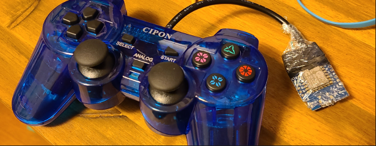

# Wifi PS2 Controller for ROS2

Wire a PS2 controller directly to an ESP8266-like device and send messages to a ROS2 topic via rosbridge_websocket. Messages are published on the `/joy` topic, of the type `sensor_msgs/msg/Joy`.



This was a bite-sized project for learning about ROS2 and should also come in handy as a universal controller within that realm.

More background here: https://www.anthonywritescode.com/ps2-controller-for-ros2-projects/

### Hardware Setup

Wiring connections
| PS2 Controller Wire | ESP8266 Pin | GPIO Number |
|---------------------|------------|-------------|
| VCC                | 3.3V        | -           |
| GND                | GND         | -           |
| Brown (D1 / DATA)        | D6         | GPIO12      |
| Orange (D0 / CMD)       | D7         | GPIO13      |
| Yellow (CS / ATT/Attention)       | D3         | GPIO0       |
| Blue (CLK/Clock)         | D5         | GPIO14      |
| Green & Gray      | Not Connected | -       |

### Configuration:
A few configurations are necessary to integrate with *your* project.  Update these values in `main.cpp` before building and flashing.

**Configure the wire variables to GPIO pins**
```
#define PS2_DAT 12 //  D6  
#define PS2_CMD 13 // D7  
#define PS2_SEL 0 //  D3  this is CS  
#define PS2_CLK 14 // D5
```

**Wifi Connection & ROS host Configurations**

The SSID and password for the network to be joined by the transmitter is required around `main.cpp:12`

In addition, the hostname or IP of the host running the rosbridge websocker server is configured near `main.cpp:14`

### Build & Flash

Build and flash the image. This project was built using the PlatformIO extension for VSCode.

Once it reboots it will look for the host with the rosbridge and start sending it messages.


### Example ROS2 integration
The folder `/ros_demo` contains a demo of how a ROS2 project would interface with this. This will run the launchfile:
```
docker compose up
```
It runs a rosbridge_websocket implementaton which handles the websocket-to-DDS bridging and a listener node ( `joy_listener.py` ) to consume the data. 


### Troubleshooting

If you're not getting messages flowing and you've triple-checked the configuration, enter the container and echo the topic directly to see what is coming through.
```
#> ros2 topic echo /joy
```
